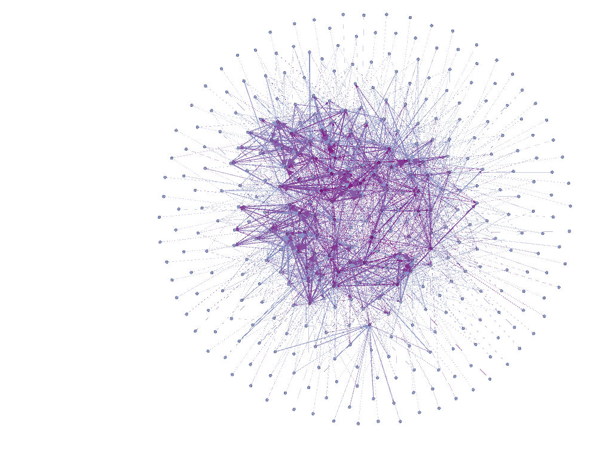

## data prep

```{r}
# load packages
library(tidyverse)

# read in data from csv
tennis <- read.csv('../data/raw/wta_matches_2015.csv')
collegefb <- read.csv('../data/raw/CFBeattendance.csv')
netflix <- read.csv('../data/raw/netflix_titles.csv')
books <- read.csv('../data/raw/books.csv')


# custom functions
select <- dplyr::select
# ggplot2 alpha (sometimes gets a conflict depending on other packages)
alpha <- scales::alpha

# color palette
UMcolors <- c('#ffcb05', '#00274c', '#407EC9', '#9A3324', '#702082', '#D86018', '#00B2A9')

```


## creating edgelist

This will be somewhat related to the network stuff we did during the school year. For starters, we will look at the college football data. Normally we would want to have a complete dataset of all games, but this will be practice.

As a reminder, one way of organizing relational data is an edgelist. Typically if we have a directed edgelist, it involves a sender and receiver. So imagine an email network, where one person sends an email to a receiver. Both are connected to each other, but the direction of the arrow has significance. 

The football and tennis data are pretty close already since there is already a Team and Opponent column. We will organize it to have a "sender" column of a losing team, who has an arrow to the "receiver" column, the winning team. This is following some publications I found in tennis (https://journals.plos.org/plosone/article?id=10.1371/journal.pone.0017249) and boxing (https://academic.oup.com/comnet/article-abstract/8/1/cnaa009/5770924).

```{r}
# select columns
edgelist <- collegefb %>% 
  select(Team, Opponent, Result)

# for some reason, some of the teams have an asterisk on them. I couldn't figure out what this meant, but we will just remove them
# for special characters, if you are doing regex, you can wrap in []
edgelist <- edgelist %>%
  mutate(Team = str_replace(Team, '[*]', '')) %>%
  mutate(Opponent = str_replace(Opponent, '[*]', ''))


# also, some team team names have No. 17 LSU, or something like that
# we will do the same thing and just replace this with empty string
edgelist <- edgelist %>%
  mutate(Team = str_replace(Team, 'No[.]\\s', '')) %>%
  mutate(Opponent = str_replace(Opponent, 'No[.]\\s', '')) %>%
  mutate(Team = str_replace(Team, '[0-9]+', '')) %>%
  mutate(Opponent = str_replace(Opponent, '[0-9]+', ''))
  
# I initially overwrite things like "North Texas", so redid the regex
# 'No[.]\\s' contains 'No' followed by '.' followed by a space (\s)
# a confusing thing with any slash character like \s is that you need to "escape" it by adding another \ in front of it


# now, check if team won or not
# sender = loser
# receiver = winner
# I'll just use more stringr functions to make new columns
edgelist <- edgelist %>%
  mutate(sender = case_when(
    str_starts(Result, 'L') ~ Team,
    str_starts(Result, 'W') ~ Opponent,
    TRUE ~ NA_character_)) %>%
  mutate(receiver = case_when(
    str_starts(Result, 'L') ~ Opponent,
    str_starts(Result, 'W') ~ Team,
    TRUE ~ NA_character_))


# keep only receiver and sender cols, and drop NA values
edgelist <- edgelist %>%
  select(sender, receiver) %>%
  na.omit()

# preview edgelist
head(edgelist)
```

Looks good enough! There are some weird text inconsistencies, like "Hawai<U+BB>i" vs. "Hawaii." Likely due to error in scraping the original dataset. I'll ignore these for now, since we would probs need to go through them one by one. 


## create network

We will use the igraph package to create a network object.
```{r}
# load library
library(igraph)

# create edgelist from dataframe..."edgelist"
net <- graph_from_data_frame(edgelist, directed = TRUE)

```

With this object, you can access values related to edges and vertices with E() and V().

```{r}
# check edges
E(net)

# check vertices
V(net)
```

Now we will try plotting...

```{r}
# plot
plot(net)

```


Woof. Kind of a mess, so we will scale some of the values in the network. Let's set some of the vertex values.

For size, I'll just take the natural log of the degree. As you might remember, degree is the number of ties/edges that any given vertex/node has. So if Michigan played 10 different teams in this dataset, they would have a degree of 10.

```{r}
# we can assign values to vertex attributes similar to dataframes
# size
V(net)$size <- log(degree(net))

# label
V(net)$label <- NA

# colors
V(net)$color <- UMcolors[2]

# plot
plot(net)
```

Forgot the arrow sizes, which are absurd for the size of some of the nodes.
```{r}
# edge size is in E() attributes
E(net)$arrow.size <- .05

# can also color the edges
E(net)$color <- UMcolors[1]

# plot
plot(net)

```

Just visually, you can tell that there are a ton of teams that had 1 game in the dataset, losing to some other more centrally placed team in the network.


## simplify edgelist

Since there are multiple games in the edgelist where one team plays/loses to/wins against another team, we can consolidate them by considering them a weighted edge. A weighted edge means that the relationship between two nodes is stronger or weaker. In this case, it just means that the two teams encounter each other more often.

I tried a few ways to do this, resulting in errors. The simplest way I found was to make a copy of the graph as an adjacency matrix.
https://stackoverflow.com/a/12998776

```{r}
# new graph
net2 <- graph.adjacency(get.adjacency(net), weighted = TRUE)

# check weight attribute
E(net2)$weight %>% head()

```

Seems to be there. if we wanted to plot, we can now add all the changes we made above to net2.


```{r}

# edge size is in E() attributes
E(net2)$arrow.size <- .05
# can also color the edges
E(net2)$color <- UMcolors[2]
# size
V(net2)$size <- log(degree(net))
# label
V(net2)$label <- NA
# colors
V(net2)$color <- UMcolors[3]

# plot
plot(net2)
```

Its not very pretty. For large networks, I would recommend plotting using Gephi (https://gephi.org/). It makes really messy plots look really good!

Here is how I save igraph network objects for use in Gephi. This would also be another way to calculate weights.
```{r}

# name edges
edge <- edgelist %>%
  rename(Source = sender,
         Target = receiver)

# get unique edge occurrences
unq <- c(edge$Source, edge$Target) %>%
  unique()

# merge with nodes and create Id column
nodes <- data.frame(
  Name = unq) %>%
  mutate(Id = 1:n()) %>%
  select(Id, Name)

# save edgelist with weights
edge <- edge %>%
  count(Source, Target, sort = TRUE) %>%
  mutate(Type = 'Directed') %>%
  rename(Weight = n)

# save to file to import in gephi
write_csv(edge, '../data/edge.csv')
write_csv(nodes, '../data/nodes.csv')
```

This will hopefully show up in the notebook, but I just quickly imported the data, applied a color, and saved it under figures in this repository. You could do a ton more. For example, you might want to apply text labels to the most important nodes in the network.



## ranking teams

Now, lets actually do something with these data. In the papers I liked earlier, they used a PageRank algorithm to sort which are the best tennis players/boxers. PageRank was made by Larry Page and colleagues (of Google fame) and is among the algorithms used to sort page results in the search engine. Rather than trying to explain it, here is the wikipedia page, which does a better job! https://en.wikipedia.org/wiki/PageRank


Anyway, igraph luckily has this built in. Following Tennant et al., we will use a damping factor of .85.

```{r}
# run algorithm on nodes
datPR <- page_rank(net2, algo = 'prpack', damping = .85)

# igraph has a weird saving structure. we want a dataframe with just team names and the pagerank, which is within the vector element of datPR
datPR <- datPR$vector

# and convert to dataframe
datPR <- as.data.frame(datPR)

# this has row names instead of its own column, so I will change that just for preference
datPR <- tibble::rownames_to_column(datPR, 'team')

# preview
head(datPR)
```

There is probably a simpler way organize the data in the way I eventually did. But it works! So who is at the top?

```{r}
# get top teams in network
datPR %>%
  arrange(desc(datPR))


```

I don't follow college football that much, but growing up in Southern California during the Pete Carroll run, I was perpetually annoyed by USC fans, so this is not the outcome I was looking for. 

Anyway, it is also important to think about what this is actually measuring... It gets at the importance of placement in the network, so its not only wins and losses but also the diversity of teams that a college has faced, and success against them. I am not sure the specifics of how colleges decide who faces off against who, but you would not see a higher PageRank for a team that did really well, but was not central to the network (say, played only within their conference). So does it makes sense to even rank teams in this way? I'd lean towards not just because not every team has the opportunity to face any given other team, but it was an interesting exercise.


## PRACTICE

Now, I am going to have you do the same thing, but with the tennis dataset.

Create and edgelist with losers pointing to winners.
(may need to clean the text using similar methods above)
```{r}


```


create an igraph object
```{r}


```


visualize in either igraph or gephi
```{r}


```


get PageRank of all tennis players and see who is most central in the network.
```{r}


```

